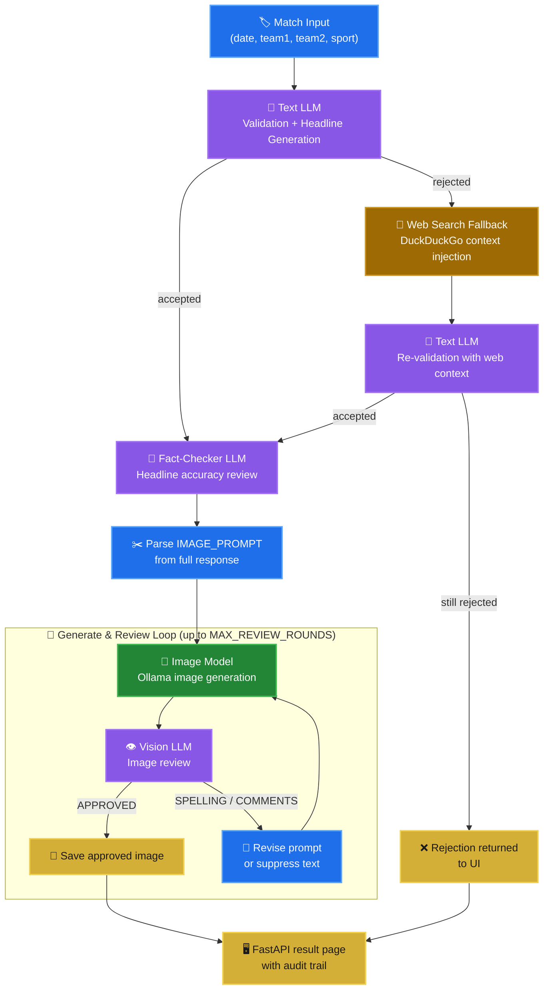

<div align="center">


[](https://github.com)


</div>

> *An automated, self-correcting AI pipeline that generates match-day postcard art using a web-search validation fallback, structured headline & prompt engineering, local image rendering, and an automated vision QA loop that catches hallucinations and spelling errors.*

> **⚠️ Disclaimer:** This project requires a locally running [Ollama](https://ollama.com) instance with a compatible image generation model (e.g. `x/z-image-turbo`) and a vision-capable text model (e.g. `minimax-m3:cloud`). Images are generated and stored on your own machine — nothing is sent to external services unless you configure otherwise.

> **Status:** Active development. Model names, review logic, and web UI are subject to change.

---

## 📑 Table of Contents

- [Overview](#overview)
- [How It Works](#how-it-works)
- [Features](#features)
- [Architecture](#architecture)
- [Pipeline Stages](#pipeline-stages)
- [Getting Started](#getting-started)
- [Web UI](#web-ui)
- [Configuration](#configuration)
- [Project Structure](#project-structure)
- [Known Limitations](#known-limitations)
- [Roadmap](#roadmap)
- [Contributing](#contributing)
- [License](#license)

---

## Overview

Give the app a match — two teams, a date, a sport — and it handles everything else. A text model validates that the match actually happened, writes five headlines for it, crafts a visual image prompt from those headlines, generates a postcard image via a local Ollama image model, then has a vision model review the result and iteratively fix it if something looks wrong.

**Match Postcard Generator** chains four distinct AI stages in a single request:

1. **Validation + headline generation** — a text LLM checks whether the match is real (with an optional web-search fallback for recent fixtures it doesn't know about), then writes the Top 5 Headlines.
2. **Fact-checking** — a second text LLM pass reviews the generated headlines for accuracy before committing to an image prompt.
3. **Image generation** — the visual portion of the response is sent to a local Ollama image model.
4. **Iterative AI review** — a vision LLM inspects every generated image against the headlines and brief, flags context mismatches or gibberish text, and triggers up to `MAX_REVIEW_ROUNDS` regeneration attempts automatically.

The whole pipeline runs locally. The only optional external dependency is a DuckDuckGo web search for validating very recent matches the model doesn't yet know about.

---

## ⚙️ How It Works

A single request flows through five stages, each handled by a dedicated AI call:

1. **🌐 Context Gathering (web-search fallback)** — If the text model can't confirm a very recent match from what it already knows, a DuckDuckGo query fires automatically. The results are injected back into the prompt as live context, and the model re-attempts validation before giving up.
2. **🧠 Prompt Synthesis (text LLM)** — Once the match is confirmed, the model writes the Top 5 Headlines and a dense, visual image prompt in one structured response. A second LLM pass then fact-checks those headlines for accuracy before the prompt is locked in.
3. **🎨 Initial Generation (image model)** — The finalized image prompt is sent to Ollama's OpenAI-compatible image endpoint (default model: `x/z-image-turbo`) to render the first draft of the postcard.
4. **🔍 Quality Assurance Loop (vision LLM)** — The text model, now acting as a reviewer, inspects the rendered image against the original brief, flagging gibberish or misspelled on-image text and visual mismatches. Up to `MAX_REVIEW_ROUNDS` (default: 3) regenerate-and-review cycles run automatically, escalating to full text suppression if spelling issues keep repeating.
5. **✅ Final Approval** — As soon as a round comes back `APPROVED` (or the round limit is reached), the image and its full round-by-round audit trail are saved to `outputs/` and shown on the result page.

This is the quick mental model — see [Pipeline Stages](#pipeline-stages) below for the full breakdown with code references.

---

## Features

|     |     |
| --- | --- |
| ⚽ **Any sport, any match** | Works for football, cricket, basketball, tennis, or any match format you type in |
| 🧠 **LLM-powered validation** | The text model rejects bad or hallucinated match inputs before a single image is generated |
| 🔎 **Web-search fallback** | If the model is uncertain about a recent fixture, DuckDuckGo results are injected as context and the model tries again |
| ✅ **Fact-checker stage** | A dedicated second LLM pass reviews generated headlines for accuracy before the image prompt is locked in |
| 🎨 **Local image generation** | Images are produced via Ollama's OpenAI-compatible `/v1/images/generate` endpoint — no cloud image API needed |
| 🔁 **Iterative AI review loop** | A vision LLM inspects every image and can trigger up to 3 automatic regeneration rounds, distinguishing context errors from gibberish text |
| 🚫 **Automatic text suppression** | After repeated spelling/gibberish failures, the prompt is automatically revised to remove all on-image text entirely |
| 🖥️ **FastAPI web UI** | A clean browser interface — enter match details, watch the postcard appear with a full round-by-round audit trail |
| 💾 **Fully traceable outputs** | Every generated image and its headline/prompt text are saved to `outputs/` with a slugified filename |

---

## Architecture



---

## Pipeline Stages

### 1 — Validation & Headline Generation

`core.build_match_prompt()` asks the text model to confirm the match is real and, if so, write five headlines and a visual image prompt in a strict format:

```
HEADLINES:
1. ...
5. ...

IMAGE_PROMPT:
[visual description — no on-image text requested]
```

If the model replies with `"You are wrong: <reason>"`, the pipeline moves to the web-search fallback before giving up.

### 2 — Web Search Fallback

`search.search_web()` fires a DuckDuckGo query for the match. Up to `WEB_SEARCH_RESULTS` hits are formatted and injected into a new prompt as live context. The text model is asked again. If it still rejects the match, a `MatchResult(valid=False)` is returned immediately.

### 3 — Fact-Checker

`core.build_fact_check_prompt()` sends the accepted headlines + image prompt through a second LLM call, asking the model to silently correct any factual errors while preserving the exact output format. This guards against confident but wrong details surviving into the image prompt.

### 4 — Image Generation & Review Loop

`core.generate_and_review_image()` runs up to `MAX_REVIEW_ROUNDS` cycles:

| Round outcome | Next action |
| --- | --- |
| `APPROVED` | Image is saved as `<slug>_approved.png` and the loop exits |
| `SPELLING` (repeated ≥ `MAX_CONSECUTIVE_SPELLING_ISSUES`) | Prompt is revised to ban all on-image text; generation retries |
| `SPELLING` or `COMMENTS` (single) | The reviewer's message is appended to the prompt as a `REVISION FIX:` instruction |
| Loop exhausted | Final image is saved without the `_approved` suffix; `ImageResult(approved=False)` is returned |

---

## Getting Started

### Requirements

- Python 3.10+
- [Ollama](https://ollama.com) installed and running (`ollama serve`)
- An image generation model pulled in Ollama (default: `x/z-image-turbo`)
- A vision-capable text model pulled or accessible (default: `minimax-m3:cloud`)
- Python packages: `fastapi`, `uvicorn`, `openai`, `jinja2`, `python-multipart`
- Optional: `ddgs` package for web-search fallback (`pip install ddgs`)

### Installation

```bash
git clone https://github.com/<your-username>/match-postcard-generator.git
cd match-postcard-generator

python -m venv .venv
source .venv/bin/activate      # Windows: .venv\Scripts\activate

pip install fastapi uvicorn openai jinja2 python-multipart
pip install ddgs               # optional — enables web-search fallback
```

### Pull the required Ollama models

```bash
ollama serve                   # start Ollama if it isn't already running
ollama pull x/z-image-turbo    # default image model
# minimax-m3:cloud is an Ollama Cloud model — run `ollama signin` first
```

### Run

```bash
python main.py
```

Then open [http://127.0.0.1:8000](http://127.0.0.1:8000) in your browser.

---

## Web UI

### Input form (`/`)

| Field | Example | Notes |
| --- | --- | --- |
| **Date** | `2025-04-12` | Any human-readable date the model can interpret |
| **Team 1** | `Real Madrid` | Full club or team name |
| **Team 2** | `Barcelona` | Full club or team name |
| **Game type** | `Football` | Sport name — used for validation and headline context |
| **Image size** | `1024x1024` | Passed directly to the Ollama image endpoint |
| **Count** | `1` | Number of independent postcards to generate (1–5) |

### Result page (`/generate`)

- Match header and web-search notice (if the fallback fired)
- Collapsible block showing the full generated headlines + image prompt text
- For each image: the postcard itself, an Approved / Not approved badge, and a round-by-round audit log showing each reviewer verdict and whether text suppression was active

---

## Configuration

All tuneable values live in `config.py`:

| Setting | Default | Description |
| --- | --- | --- |
| `OLLAMA_BASE_URL` | `http://localhost:11434/v1/` | OpenAI-compatible base URL for the image endpoint |
| `OLLAMA_URL` | `http://localhost:11434/api/generate` | Raw generate endpoint used for text/vision calls |
| `IMAGE_MODEL` | `x/z-image-turbo` | Ollama image model name |
| `TEXT_MODEL` | `minimax-m3:cloud` | Text + vision model used for validation, fact-checking, and review |
| `DEFAULT_SIZE` | `1024x1024` | Default image dimensions |
| `OUTPUT_DIR` | `outputs` | Directory where images and prompt text files are saved |
| `MAX_REVIEW_ROUNDS` | `3` | Maximum generate-review cycles per image before giving up |
| `MAX_CONSECUTIVE_SPELLING_ISSUES` | `1` | Consecutive spelling verdicts before all on-image text is suppressed |
| `WEB_SEARCH_RESULTS` | `5` | Maximum DuckDuckGo hits injected as web context |

---

## Project Structure

```
match-postcard-generator/
├── main.py              # Entry point — starts the FastAPI server via uvicorn
├── config.py            # All tuneable settings: models, URLs, limits, paths
├── core.py              # Full pipeline: validation, fact-check, generate, review loop
├── client.py            # OllamaImageClient — thin wrapper around the OpenAI-compatible image API
├── search.py            # DuckDuckGo web search + context formatter
├── web.py               # FastAPI app: GET / and POST /generate routes
├── __init__.py          # Package marker
├── templates/
│   ├── index.html       # Match input form
│   └── result.html      # Postcard result page with audit trail
└── outputs/             # Generated at runtime — images (.png) and prompt text (.txt)
```

---

## Known Limitations

- **Single model for all text tasks** — validation, fact-checking, and image review all call the same `TEXT_MODEL`. A model that is strong at one may be weaker at another; tiering these to different models would improve quality.
- **Vision review quality is model-dependent** — if `TEXT_MODEL` doesn't support image input well, the review loop will consistently fall back to the `comments` path and exhaust all rounds without converging.
- **No CLI entrypoint** — the app is web-only; there's no `--cli` flag for scripted or batch use.
- **Web search is best-effort** — `search_web()` silently returns `[]` on any failure (missing `ddgs` package, rate limits, network errors). There is no user-visible warning when the fallback silently fails.
- **`outputs/` is never pruned** — images and prompt files accumulate across runs; there is no built-in cleanup mechanism.
- **Count > 1 reuses the same image prompt** — when generating multiple postcards for the same match, all variants share a single image prompt rather than getting independently varied prompts.
- **No authentication on the web UI** — the app is intended for local use only; do not expose port 8000 publicly without adding auth.

---

## Roadmap

<details>
<summary><strong>Click to expand</strong></summary>

- [ ] Add a CLI entrypoint for batch/scripted generation without the web server
- [ ] Support separate model configs for validation, fact-checking, and image review
- [ ] Vary the image prompt per postcard when `count > 1` (style/angle variation)
- [ ] Surface web-search failures as a visible warning in the UI rather than a silent no-op
- [ ] Add an `outputs/` cleanup or rotation policy (max N files, or by date)
- [ ] Dockerize the app so Ollama, Python dependencies, and the web server start together
- [ ] Add a download button for each generated postcard image in the result UI
- [ ] Expose a `/api/generate` JSON endpoint alongside the HTML form for programmatic use

</details>

---

## Contributing

Issues and pull requests are welcome. When reporting a bad generation or a review loop that never converges, please include the match input, your `config.py` model names, and the relevant `outputs/<slug>_prompt.txt` file — it's the fastest way to reproduce the issue.

---

## License

MIT — see `LICENSE` for details.

<div align="center">


</div>